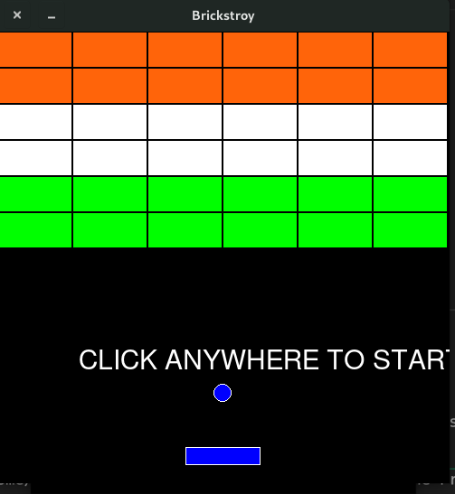

# Brick Breaker Game

Brick Breaker (The game) is a Breakout clonewhich the player must smash a wall of bricks by deflecting a bouncing ball with a paddle. The paddle may move horizontally and is controlled with the side arrow keys.

## Setup instructions

Run `python/python3 brick_breaker.py`

## Starting image.

## Ending Image

